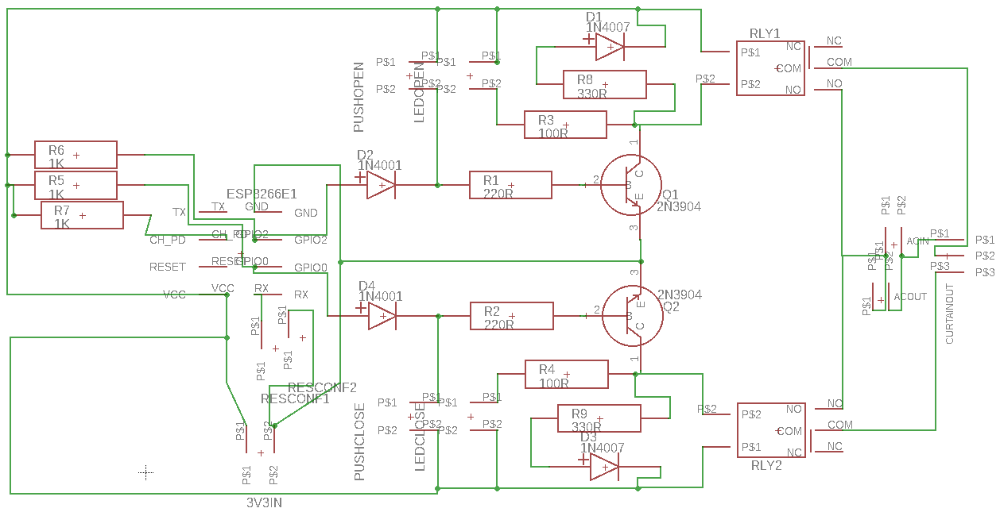
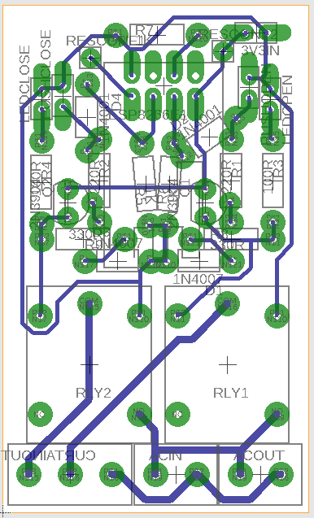
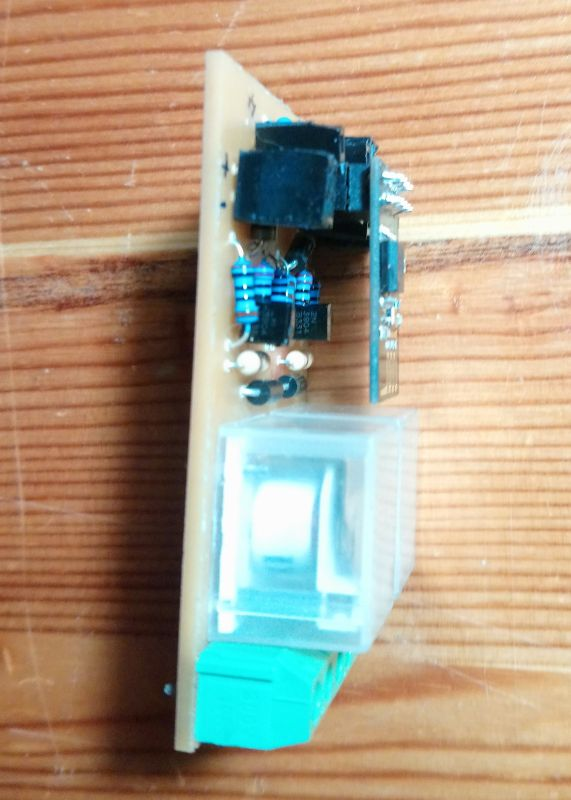
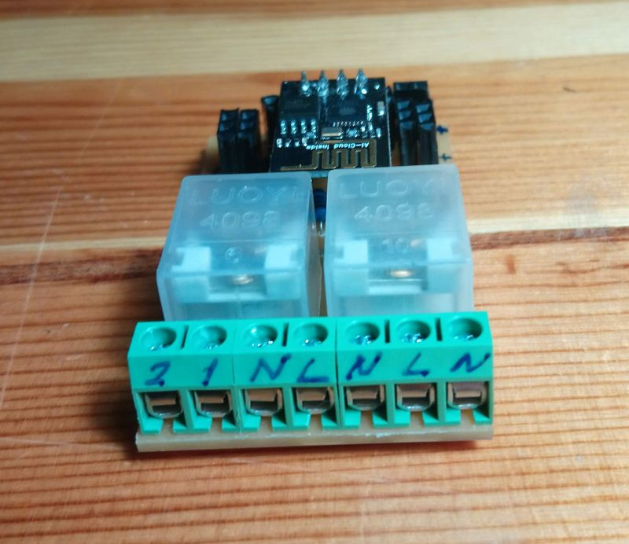
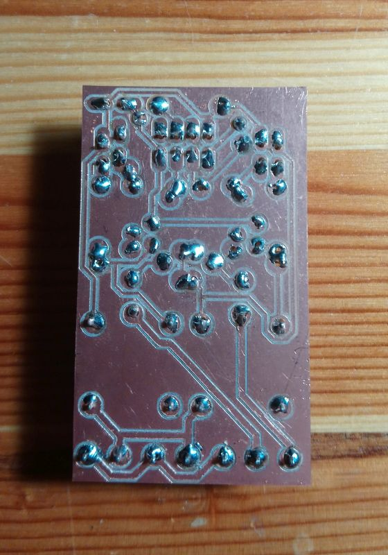

# Introduction

This project is about a dual relay circuit driven by a ESP8266-01. We developed and built the circuit, and implemented the code nearly from scratch. You can find the circuit, the managing code, an accelerated test setup, and an online application in the following sections.  

We developed it with Kutalmış İnce to mobilize the curtains in our bedrooms so that they automatically open up at 7AM and closes down at 6PM. We also wanted them to be manually controllable via simple push buttons and programmable via an online interface.  

We tried to be sure about all the components we used and each line of code we wrote, but please comment if you notice something wrong or inappropriate. And, let me remind you that the following circuit involves an high voltage AC application, so please take necessary precautions before getting your hands dirty.  

So, let's get into the details.  

# The circuit

We modeled the circuit using EAGLE. Related files can be found in `pcb` folder (TODO). However, the devices used in the circuit model file is coming from my custom devices library. You need to have this library introduced to EAGLE beforehand. The library can be downloaded [here](https://github.com/tolgakurt/eagle-parts-library).  

The developed schematic is basically a simple relay circuit switched by a single transistor.  



## AC line

The circuit does not include a power supply, however we wanted it to hold all the interface required. We are using [this circuit](https://www.banggood.com/AC-DC-3_5W-Isolated-AC-110V-220V-To-DC-3_3V-1A-Switch-Power-Supply-Converter-Module-p-1088504.html?rmmds=buy&cur_warehouse=CN) to supply 3.3V DC to the circuit. You need to connect your AC line to the ACIN connector. ACOUT basically parallels this source, so that it can be transferred to the input rail of the power supply. ACIN is also connected to the relays' COM and NO legs. CURTAINOUT connector will deliver power up to two devices. We called it CURTAINOUT, because we are using this circuit to open and close our motor curtains. We use one pin to open the curtain, and the other to close. The last one goes to the neutral line of the motor.  

## DC line

As I mentioned, the power is supplied by an external circuit. This circuit has a single input at 3V3IN for all the components. P$1 is the positive leg and P$2 is the GND. Generally it is a better practice to isolate the relays from the driver circuit because of the voltage spikes generated by the coil in the relay with the help of an optocoupler, but this necessitates a secondary power source. However, we wanted to keep this simple and cheap. More on spike protection below.  

## Powering up ESP-01

ESP-01 is a small and cheap IC, and has only 2 GPIO pins which is barely enough for a simple project like this. Moreover, these IO pins are also used to determine the boot mode. More on this subject [here](https://www.forward.com.au/pfod/ESP8266/GPIOpins/ESP8266_01_pin_magic.html).  

Basically, you need to pull both IO pins high to boot from SPI flash (which is the normal operating mode). So, you need to connect these pins to power source using resistors. In the article linked above, 3.3K resistors are adviced, however, during our tests, We found out that 3.3K may be too much to pull IO pins to high. Using 3.3K, something like 1 in 10, ESP-01 cannot start from SPI flash. So, we tried again using 2.2K and 1K, and found that 1K never fails to boot correctly. We are not entirely sure about the reason, please correct us on this if we're wrong.  

You need to connect VCC pin to +Vs and GND pin to GND directly. You also need to connect CH_PD pin to +Vs.  

The GPIO pins are used to drive the relays, but we also needed an input to reset the WiFi configuration of the ESP-01 in case of a configuration change in WiFi. So, we used RX pin as a pullup input. To do that you need a switch which is normally open between RX and GND pins. When you close this switch, you can the read the input on pin number 3.  

## Driving relays

At first, we were driving the relays only using the ESP-01, but we thought that it would be nice to have some buttons, which can also control the relays in parallel to ESP-01. This is somehow a very handy feature since your ESP-01 may become bricked or you cannot (or don't want to) reach ESP-01 over WiFi. PUSHOPEN and PUSHCLOSE switches are introduced for this reason. They are connected to +Vs and base of the transistors via a resistor. IO0 and IO2 pins are also connected in that manner, however there are D2 and D4 in between, which prevents the current flowing in IO pins when PUSH buttons are closed.  

The relays we used are triggered at 3V and they use a current of 105mA to operate. For the spike protection, we used a single reverse-biased diode together with a 330R resistor. This resistor is used to smooth the current when the coil is discharging. A better approach is to use a zener instead of this resistor, but we couldn't figure out the values since we don't have an oscilloscope. (TODO try to use a zener)  

Parallel to the relay and spike suppression components, there is a low-power led, which is used to indicate if the transistor is switched on. These leds are known to have a forward voltage of 2.0V, so they will leave 1.3V behind. They need a current in between 5-20mA, so a 100R resistor will let 13mA to pass, which is OK.  

So, we require a total current of about 120mA to enter to the collector of the transistors. We used 2N3904 transistors since they can support a collector current of 200mA continuously. They are commonly found and are very cheap. You can also use something like 2N2222, it will let 1A to pass, but obsessive enough, we don't like using redundant specs :) But beware of using some other commonly found transistors like BC547 since they are rated as 100mA max.  

We will use these transistors not in linear region, but in saturation mode as simple switches. So, we need to determine the base current using the gain characteristics of 2N3904. [In its datasheet](https://www.sparkfun.com/datasheets/Components/2N3904.pdf), it says that the minimum gain is 30 when the collector is at 100mA and Vce is 1V. We access the base via a diode, so we have a drop of 0.7V there. The base needs to operate at 0.7V also. We begin with 3.3V at the pins. Thus we have 3.3V - 0.7V - 0.7V = 1.9V. This is close to 1V, so we will assume the minimum gain suggested in the specs: 30.  

We need to have a current of 120mA in the collector, thus we need 4mA in the base. 220R base resistor gives us 5mA, which is guaranteed to close the switch while letting a collector current of 150mA. On the other hand, 5mA is safely less than 12mA, which is the source current of ESP-01 GPIO pins.  

The switch does not pass over a diode as the GPIO pins, so it will introduce slightly more current to the base, which is not a problem.  

## Etching

The EAGLE files are in `pcb` folder. So you can create the etching mask if you are using chemicals to create the nets. We use my custom made CNC Etching Device, so we generated gcode using the `PCB-GCode` plugin. You can find related information [here](http://www.richa1.com/RichardAlbritton/create-g-code-from-an-eagle-file/). The gcode generated by this plugin is also given in `gcode` folder, however, these files may not be compliant with whatever CNC machine you have in hand or the PCB board you use.  

The board we created is for a single-sided PCB and looks as such:  



The board fits in a frame of size 36mm by 60mm. We used pin plugs to free the leds, push buttons, DC in, and ESP-01. This also lets us put the ESP-01 up above other components saving up space. We used 5mm connectors to connect AC rails which are directly soldered into the board. You can separate them as well. Etched and soldered PCB looks like these:  

  
  
  
  
  

# Test Setup

To test the board, we developed a simple flip-flop code for ESP-01 which can be found in `test` folder. It basically sets the pin roles and initializes pin modes. Then in loop function, it sends a signal to the first relay for 5 seconds. Then it stands by for another 5 seconds. It repeats the same procedure for the second relay. It lights up the builtin led when the switch connected to the RX pin is closed. This way, you can test the device visually. Here is a video showing this procedure:  

[Youtube video](https://www.youtube.com/watch?v=AhVkFz1hL98)

## Accelerated long term test

TODO  

The test mentioned above is a short term test and can only show obvious mistakes. To check the long term performance of the module, we devised the following test.  

The actual power supply that will used in production is connected to the module and system is powered on. So, the relays began clicking at 5 second intervals.  

AC line is connected to the both relays and they power up two 5V AC/DC supplies.  

The output of the AC/DC is connected to an optocoupler with a large resistor in between and then to ground.  

The optocoupler triggers the signal and Arduino detects these signals. This Arduino is connected to a data logger shield and a real time clock module. Logged data is in the following format:  

```
18.12.2018 21:26:12 Pin4 High
18.12.2018 21:26:17 Pin4 Low
18.12.2018 21:26:22 Pin5 High
18.12.2018 21:26:27 Pin5 Low
18.12.2018 21:26:32 Pin4 High
...
```

For example, after 5 days you should have 5 * 24 * 60 * 60 / 5 = 86400 items in your log. If the test succeeds, you can rely on the the robustness of the system.  

# An online application

TODO  
