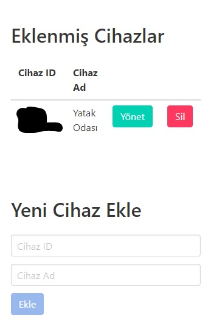
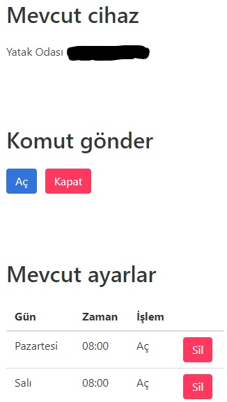
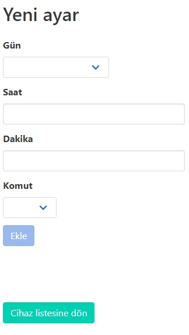

# Frontend for Device Control

The user interface to control the devices is implemented as a progressive web application (PWA), based on [this boilerplate](https://github.com/oliverjam/minimal-pwa). PWAs provide really quick solutions for projects such as this one. Originally, PWAs are primarily developed to make web applications work in offline mode, however they also allow the applications to be installed to the device looking and feeling as a native application, receiving push notifications, running background processes, etc. I chose to implement a PWA in this project not because we should do anything offline (all features needs internet connection), or any other advantages they provide, but to easily install the application to our mobile devices without going in the application markets, etc.  

We don't need any offline features, so, the `service-worker.js` is configured to redirect `fetch` requests directly to the online interface. The only backend we communicate with is an Azure Function App which is included and explained in `azureFunctions` folder.  

The application consists of two pages: Entry page (`index.html`) and device management page (`schedule.html`) which are defined below.  

## Used Frameworks

I utilized [Vue.js](https://vuejs.org/) basically for templating. It is a very lightweight framework with a very shallow learning curve. It is also easy to bootstrap. It was the first time I used this framework and I liked it very much.  

For styling, I used [bulma](https://bulma.io/) since it is more lightweight than Bootstrap and is CSS-only.  

## Entry Page

This page allows the user to add a device by entering the id of the device as defined in Azure IoT Hub and a friendly name. Whenever a device is added in this page, a request to `getSchedule` function is sent. It will return the schedule of the added device if that device exists in Azure IoT Hub and is enabled. The devices added this way will also be listed in this page. Added devices are saved in the persistent storage thanks to the `localStorage` API. Business logic of this file is handled by `assets/index.js`.  

The buttons next to the device in the list is used to manage that device and to delete the device from the list. The page looks like this:  

## Device Management Page

This page is used to instantaneously control and modify the schedule of the selected device. The page should be loaded with a query variable called `deviceId` so that the application will know which device we are managing. Business logic of this file is written in `assets/schedule.js`.  

The selected device appears at the top. The friendly name of the device is read from `localStorage`.  

Then comes the buttons to invoke instantaneous methods on the device: `openCurtain` and `closeCurtain`. Whenever one of these buttons are clicked, a request is dispatched to the interface handled by `invokeDeviceMethod` Azure function. The response is shown to the user in an `alert` box.  

The following list is for the scheduled actions. There is also a button to delete a specific action. Whenever that button is clicked, related action is deleted from the schedule information and whole schedule is sent to the `setSchedule` Azure function. If it responds OK to that request, the schedule in the `localStorage` is updated and this list is re-rendered.  

The screen up to this point looks like this:  

The form coming after the list allows the user to update the schedule with additional actions. It basically asks the day, hour, minute, and action. Even if an action can only include day information for a specific day, there are options to add actions for all weekdays/weekend days/all days. If one of these options are selected, a different action is created for each day that the option indicates.  

The button at the bottom lets the user to go back to the entry page.  

Rest of the page looks like this:  

## Azure Blob Storage

You can deploy this application to any place, but I chose the same Azure Storage account, which I use to store my Azure Functions and tables. If you deploy this to the blob storage of the same account as a static website, you can get a publicly accessible URL for it and bootstrap quickly. The URL of my deployment is [https://curtainstorage.z6.web.core.windows.net](https://curtainstorage.z6.web.core.windows.net).  