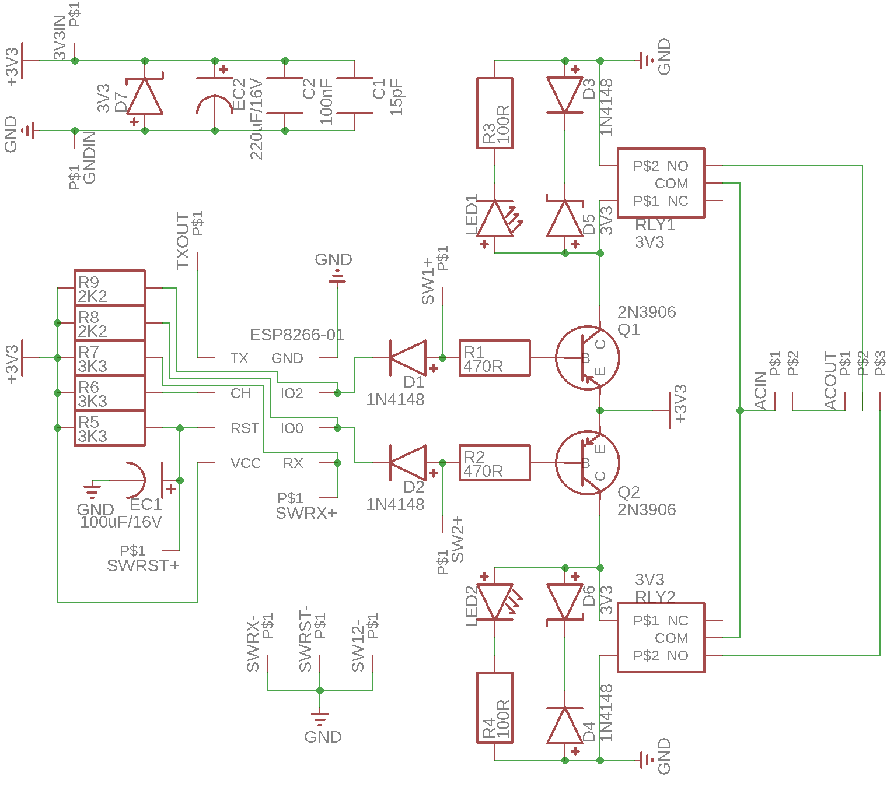
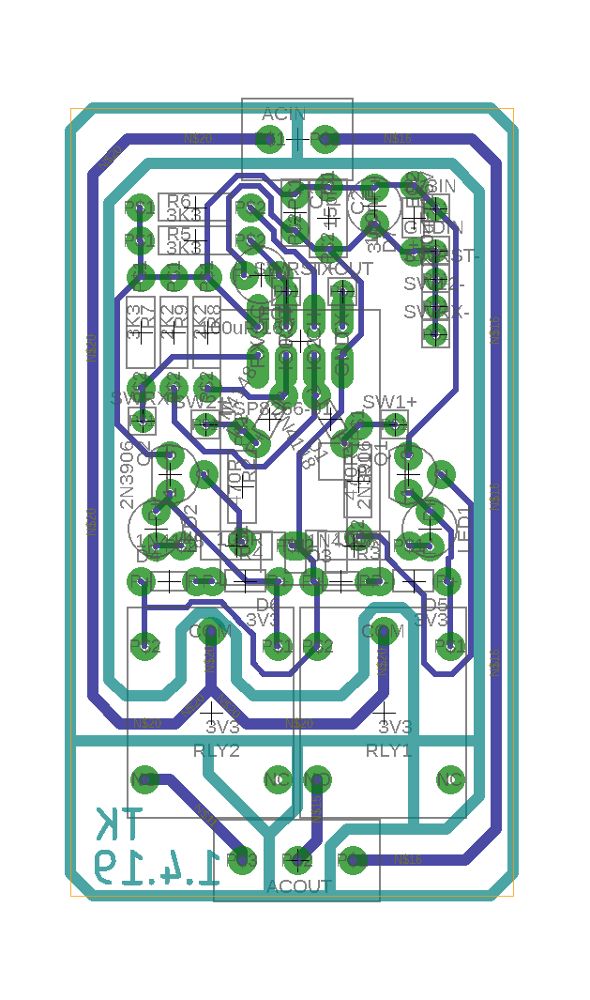
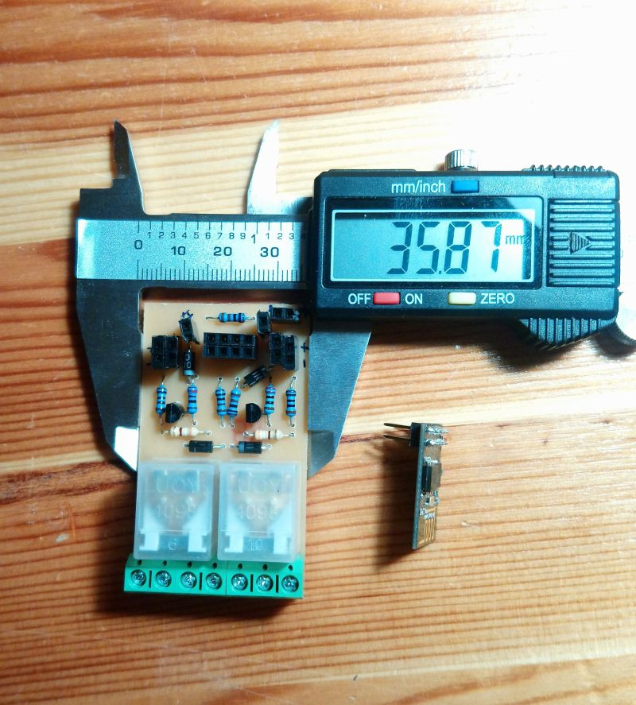

# The Schematic

We modeled the circuit using EAGLE. However, the devices used in the circuit model file is coming from my custom devices library. You need to have this library introduced to EAGLE beforehand. The library can be found [here](https://github.com/tolgakurt/eagle-parts-library).  

The schematic of the circuit is as such:  

## AC Line

The circuit does not include a power supply, so you need to have a 3.3V DC output power supply rated with at least 500mA. We are using [this circuit](https://www.banggood.com/AC-DC-3_5W-Isolated-AC-110V-220V-To-DC-3_3V-1A-Switch-Power-Supply-Converter-Module-p-1088504.html?rmmds=buy&cur_warehouse=CN). You need to connect your AC line to the `ACIN` connector and you can also connect parallel cables to the input rail of the power supply from `ACIN`. `ACOUT` connector will deliver power up to two devices. We use one pin in `ACOUT` connector to open the curtain, and the other to close. The last one goes to the neutral line of the motor. You can also use one more pin in each connector to connect the ground cable.  

## DC Line

As I mentioned, the power is supplied by an external circuit. This circuit has a single input at `3V3IN` connector for all the components. Generally it is a better practice to isolate the relays from the driver circuit because of the voltage spikes generated by the coil in the relay with the help of an optocoupler, but this necessitates a secondary power source. However, we wanted to keep this simple and cheap. More on spike protection below.  

## Powering Up ESP-01

ESP-01 is a small and cheap IC, and has only 2 GPIO pins which is barely enough for a simple project like this. Moreover, these IO pins are also used to determine the boot mode. More on this subject [here](https://www.forward.com.au/pfod/ESP8266/GPIOpins/ESP8266_01_pin_magic.html).  

Basically, you need to pull both IO pins high to boot from SPI flash (which is the normal operating mode). So, you need to connect these pins to 3V3 rail using resistors. In the article linked above, 3K3 resistors are adviced, however, during our tests, We found out that 3K3 may not be strong enough to pull IO pins high. Using 3K3, something like 1 in 10, ESP-01 couldn't start from SPI flash. So, we tried again using 2K2, and found that it always booted correctly. We are not entirely sure about the reason, please correct us on this if we're mistaken.  

You need to connect `VCC` pin to 3V3 rail and GND pin to ground directly. It is also a good practice to pull `CH_PD` and `RST` pin high, so we connected them to 3V3 rail via 3K3 resistors. Moreover to that, we connected `RST` pin to ground via a 100uF capacitor to prevent the device from boot during power up phase for a short period, till the supply rail becomes steady. Also, `SWRST+` pin is connected to `RST` pin, so that you can connect a switch in between this and `SWRST-` pin and reset the device with that.  

The GPIO pins are used to drive the relays, but we also needed an input to reset the WiFi configuration of the ESP-01 in case of a configuration change in WiFi. So, we used `RX` pin as a pullup input. When `RX` pin is initialized as `INPUT_PULLUP`, it is internally pulled high weakly. To be sure, we also connected it to 3V3 rail with a 3K3 resistor. If you connect a switch in between `SWRX+` pin and `SWRX-` and close this switch, RX pin will read low and then you can reset the WiFi configuration. A pin is also connected to `TX` to be able to connect to the device and view the logs in serial monitor while debugging.  

In addition to the power supply, it is always a good practice to put some decoupling capacitors close to `VCC` and `GND` pins of ESP-01, so we included a 15pF and a 100nF capacitors. More than that, we observed that the power supply cannot function steadily when the relays are clicking, so we placed a 220uF capacitor and a 3V3 zener parallel to the decoupling capacitors to clamp and smooth the voltage spikes which dramatically enhanced the stability of ESP-01.  

## Driving Relays

ESP-01 cannot drive the relays directly since it can source only 12mA current, which is not enough to activate the relays. So, there needs to be a transistor in between to control the current over the relays, and these transistors need to be PNP type because their base are connected to GPIO pins which are inevitably connected to 3V3. In this configuration, `IO0` and `IO2` are pulled high in the beginning of ESP-01 `setup` function and when a relay needs to be activated, connected GPIO pin is pulled low.  

At first, we were driving the relays using only the transistors and ESP-01, but we thought that it would be nice to have some buttons or switches, which can also control the relays in parallel to ESP-01. This is somehow a very handy feature since your ESP-01 may become bricked or you cannot (or don't want to) reach ESP-01 over WiFi. `SW1+` and `SW2+` pins are introduced for this reason. So that, you can connect a switch in between these pins and `SW12-` pin, which goes to ground, and pull the base of the transistors low and activate the transistors. But you need to prevent the current flowing from `IO0` and `IO2` to ground. For this reason, there are `D1` and `D2` in between, which prevents flow in that direction.  

The relays we used are triggered at 3V and they use a current of 105mA to operate. For the spike protection, we used a reverse-biased diode in combination with a 3V3 zener. Generally, a single diode is advised, but an additional zener helps to extend relay life as described [here](https://www.te.com/commerce/DocumentDelivery/DDEController?Action=srchrtrv&DocNm=13C3264_AppNote&DocType=CS&DocLang=EN).  

Parallel to the relays and spike suppression components, there is a low-power led, which is used to indicate if the relay is switched on. These leds are known to have a forward voltage of 2.0V, so they will leave 1.3V behind. They need a current in between 5-20mA, so a 100R resistor will let 13mA to pass, which is OK.  

So, we require a total current of about 120mA and the transistors should let that. We used 2N3906 transistors since they can support a collector current of 200mA continuously. They are commonly found and are very cheap. You can also use something like 2N2222 which lets 1A to pass. But beware of using some other commonly found transistors like BC557 since they are rated as 100mA max.  

We will use these transistors not in linear region, but in saturation mode as simple switches. So, we need to determine the base current using the gain characteristics of 2N3906. [In its datasheet](https://www.sparkfun.com/datasheets/Components/2N3906.pdf), it says that the minimum gain is 30 when the collector is at 100mA and Vce is 1V. We access the base via a diode, so we have a drop of 0.7V there. The base needs to be 0.7V lower than the emitter. Thus we have 3.3V - 0.7V - 0.7V = 1.9V left. This is close to 1V, so we will assume the minimum gain suggested in the specs: 30.  

We need to have a current of 120mA in the collector, thus we need 4mA in the base which can be ensured with a 470R base resistor. On the other hand, 4mA is safely less than 12mA, which is the recommended sink current limit of ESP-01 GPIO pins.  

The switch does not pass over a diode as the GPIO pins, so it will introduce slightly more current to the base, which is not a problem.  

# The Board

As I mentioned, the components used in the circuit model file is coming from my custom devices library. I developed this library to create custom packages that fits [my custom made CNC machine](https://github.com/tolgakurt/my-custom-cnc). DRC rules, pad diameters, trace widths are all set according to the specs of this machine. Finally, the board we created is for a single-sided PCB and looks as such:  

Let me remind you that this circuit involves high voltage AC application, so please take necessary precautions before getting your hands dirty.  

## Etching

`.sch` and `.brd` files are in this directory, so you can create the etching mask if you are using chemicals to create the nets. We used my custom made CNC machine, so we generated gcode using the `PCB-GCode` plugin. You can find related information [here](http://www.richa1.com/RichardAlbritton/create-g-code-from-an-eagle-file/). The gcode generated by this plugin is also given in `gcode` folder. You can use them if somehow your device is similar to mine.  

The teal colored lines represent the milling routes with 0.5mm of depth and 1mm of width. These lines are used to isolate the AC line from the DC part better. They also isolate AC lines from each other. With these lines in place, you can actually delete the trace lines carrying AC.  

The same teal colored lines also indicate the outer frame, so you may need to modify gcode to change the depth of these outer lines to 1.5mm, so that the circuit can be cut out of the whole PCB.  

The board fits in a frame of size 36mm by 60mm. We used male pins to connect push buttons and switches (which are not embedded on PCB, but placed on a 3D printed box), and DC. Likewise we used female pin plugs to connect ESP-01. This way, we can put the ESP-01 up above other components saving up space. We used 5mm connectors to connect AC rails which are directly soldered into the board. You can separate them as well.  

These photos are from an earlier iteration and does not fully represent the board given above; but they will represent the idea more or less:  

  
  
  
  
  
